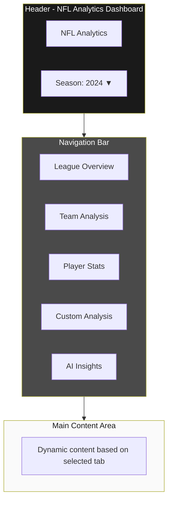
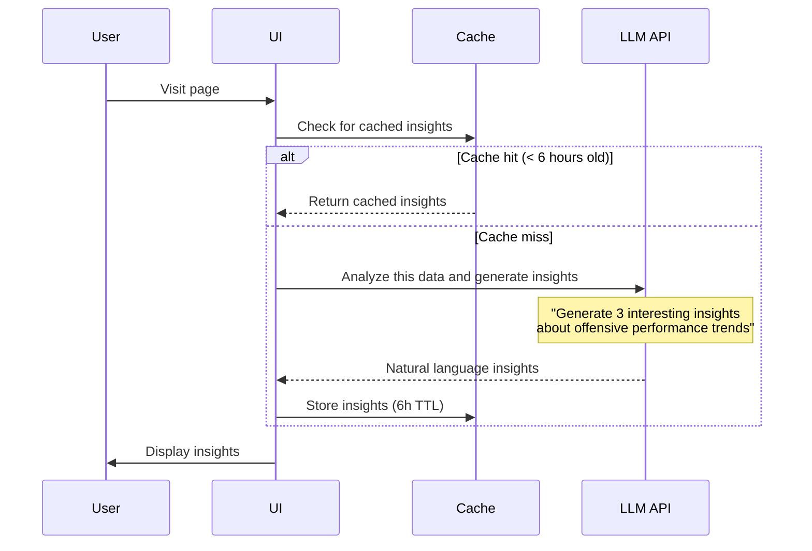
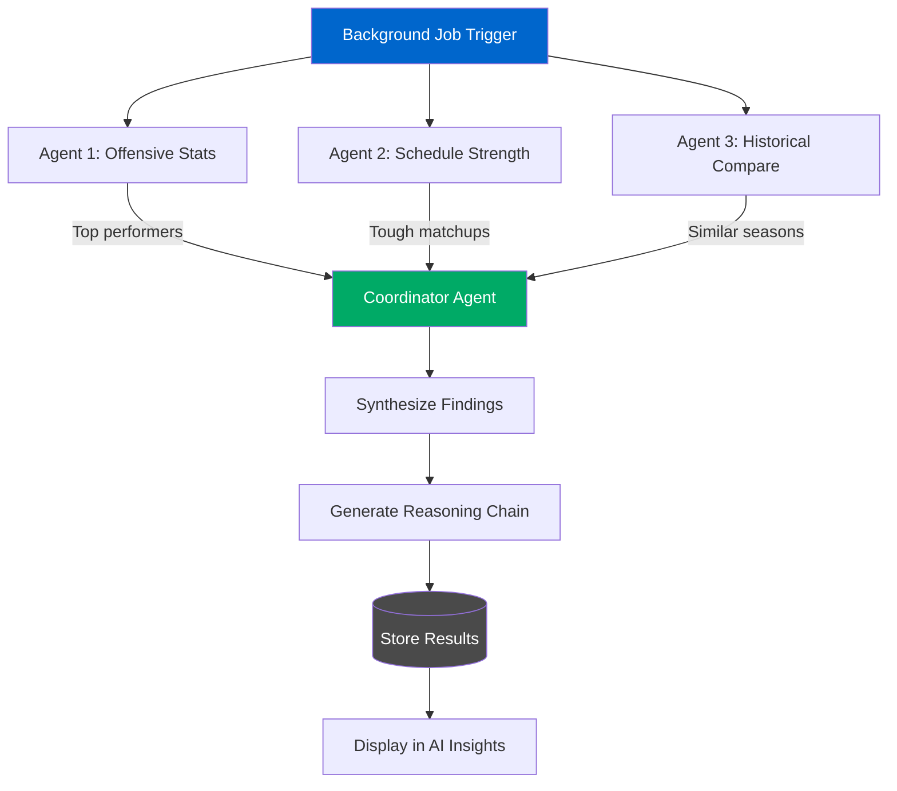
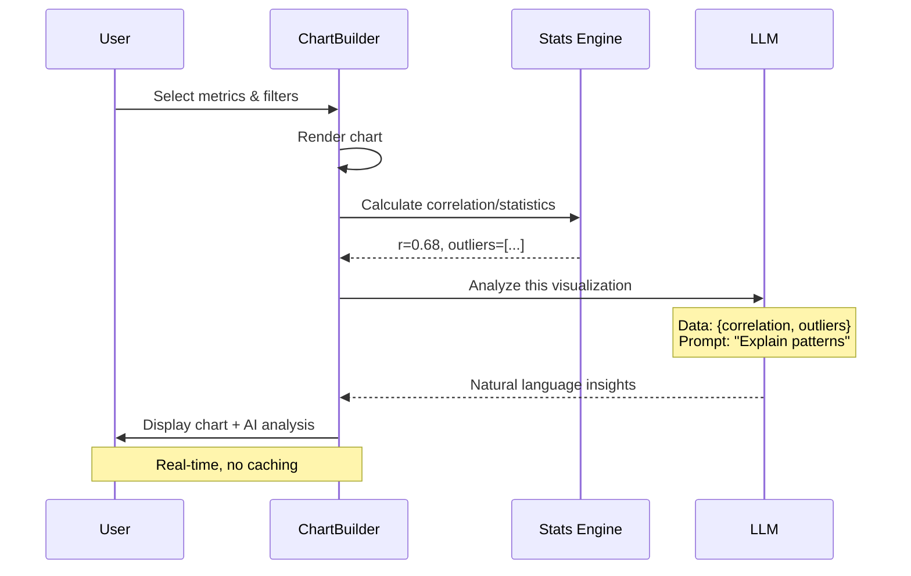
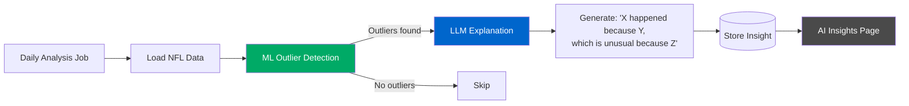
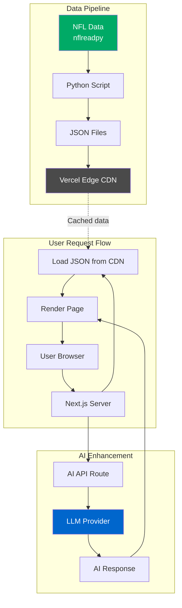
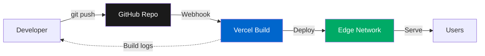
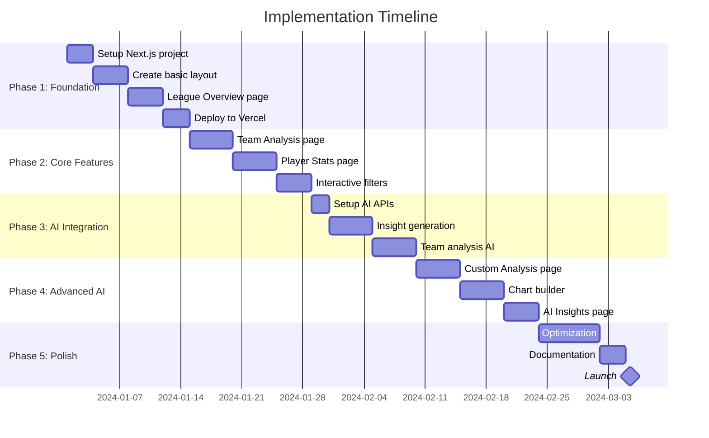

# 🏈 NFL Analysis Dashboard - Vision Document

## Overview
A modern, interactive NFL analytics platform that uses AI to surface insights, predict outcomes, and help users understand the game at a deeper level. Beautiful design meets intelligent analysis.

---

## 🎨 Design Philosophy

**Inspired by:** Apple's design language, Dieter Rams principles, modern data visualization (Observable, Tableau)

**Key principles:**
- **Minimalist & Clean** - Remove visual noise, focus on data
- **Responsive & Fast** - Smooth animations, instant feedback
- **Intelligent** - AI works invisibly to enhance experience
- **Discoverable** - Guide users to interesting insights

**Color Palette:**
```
Primary: #1A1A1A (Rich Black)
Secondary: #4A4A4A (Charcoal)
Accent: #0066CC (NFL Blue)
Success: #00AA66 (Positive EPA)
Warning: #DD4400 (Negative EPA)
Background: #FAFAFA (Off-white)
Surface: #FFFFFF (Pure white cards)
```

---

## 📱 Page Structure

### **Layout:**



---

## 🚀 Core Features (Pages/Tabs)

### **1. League Overview** 📊 (Home page)
**What users see:**
- Hero stats (animated numbers counting up)
  - Total plays this season
  - Touchdowns scored
  - Average EPA league-wide
- Interactive team comparison chart
  - Sortable bar chart of all 32 teams by EPA
  - Hover shows detailed stats
  - Click team to drill down
- **AI Feature:** "Insights" card that updates weekly
  - "The Lions' offense is on pace to break the single-season EPA record"
  - LLM analyzes trends and writes 2-3 key insights

**Wireframe:**
```
┌────────────────────────────────────────────────┐
│  League Overview - 2024 Season                 │
├────────────────────────────────────────────────┤
│                                                 │
│  ┌──────────┐  ┌──────────┐  ┌──────────┐    │
│  │ 45,892   │  │  2,847   │  │  0.042   │    │
│  │ Plays    │  │  TDs     │  │ Avg EPA  │    │
│  └──────────┘  └──────────┘  └──────────┘    │
│                                                 │
│  ┌─────────────────────────────────────────┐  │
│  │  🤖 AI Insights                         │  │
│  │  • Detroit leading league in EPA/play   │  │
│  │  • QB performance up 12% vs 2023        │  │
│  │  • Rushing efficiency at 5-year low     │  │
│  └─────────────────────────────────────────┘  │
│                                                 │
│  Team Offensive Efficiency (EPA/Play)          │
│  ┌─────────────────────────────────────────┐  │
│  │ DET  ████████████████░░░░  0.18        │  │
│  │ KC   ███████████████░░░░░  0.15        │  │
│  │ SF   ██████████████░░░░░░  0.13        │  │
│  │ BUF  ██████████████░░░░░░  0.13        │  │
│  │ ...                                     │  │
│  └─────────────────────────────────────────┘  │
│                                                 │
└────────────────────────────────────────────────┘
```

---

### **2. Team Analysis** 🏟️
**What users see:**
- Team selector (with logos if possible)
- Multi-season comparison (2020-2024)
- Split view: Passing vs Rushing performance
- Trend lines showing improvement/decline
- **AI Feature:** Automated game analysis
  - "The Chiefs' 4th quarter EPA is 0.32, 40% better than league average"
  - "Key strength: Red zone efficiency (Top 3)"
  - AI agent analyzes team data and generates natural language summary

**Wireframe:**
```
┌────────────────────────────────────────────────┐
│  Team: Kansas City Chiefs          [Select ▼] │
├────────────────────────────────────────────────┤
│                                                 │
│  ┌─────────────────────────────────────────┐  │
│  │  🤖 Team Analysis (AI-Generated)        │  │
│  │                                          │  │
│  │  The Chiefs rank 2nd in offensive EPA,  │  │
│  │  driven by elite passing efficiency      │  │
│  │  (0.25 EPA/play). Their rushing attack  │  │
│  │  improved 18% since week 8.             │  │
│  │                                          │  │
│  │  Key Matchup: vs BUF defense (Sat)      │  │
│  └─────────────────────────────────────────┘  │
│                                                 │
│  Passing Performance          Rushing Stats    │
│  ┌───────────────────┐       ┌──────────────┐ │
│  │  EPA/Play: 0.25   │       │  EPA: 0.08   │ │
│  │  Yards: 4,892     │       │  Yards: 1,847│ │
│  │  TDs: 38          │       │  TDs: 12     │ │
│  │                   │       │              │ │
│  │  [Line Chart]     │       │  [Line Chart]│ │
│  │  Trend over       │       │  Trend over  │ │
│  │  season ↗         │       │  season →    │ │
│  └───────────────────┘       └──────────────┘ │
│                                                 │
└────────────────────────────────────────────────┘
```

---

### **3. Player Statistics** 👤
**What users see:**
- Position selector (QB, RB, WR, TE)
- Sortable leaderboards with filtering
- Interactive scatter plots (EPA vs Volume)
- Player cards with photos (if available via API)
- **AI Feature:** Player spotlight
  - "Lamar Jackson's EPA improved 25% in games with wind >15mph"
  - LLM finds interesting correlations and patterns
  - "Players to watch" recommendations

**Wireframe:**
```
┌────────────────────────────────────────────────┐
│  Player Stats    [QB▼]  Min Attempts: [100]   │
├────────────────────────────────────────────────┤
│                                                 │
│  ┌─────────────────────────────────────────┐  │
│  │  🤖 Player Spotlight                    │  │
│  │                                          │  │
│  │  Lamar Jackson leads all QBs in rushing │  │
│  │  EPA while maintaining elite passing    │  │
│  │  efficiency. His dual-threat ability    │  │
│  │  generates +0.35 EPA per game.          │  │
│  └─────────────────────────────────────────┘  │
│                                                 │
│  QB Leaderboard (by EPA/Play)                  │
│  ┌─────────────────────────────────────────┐  │
│  │ Rank │ Name           │ EPA  │ Att │ TD │ │
│  │   1  │ L.Jackson      │ 0.28 │ 387 │ 31││ │
│  │   2  │ P.Mahomes      │ 0.25 │ 445 │ 38││ │
│  │   3  │ J.Burrow       │ 0.23 │ 412 │ 34││ │
│  │  ... │                │      │     │   │ │
│  └─────────────────────────────────────────┘  │
│                                                 │
│  Performance Visualization                      │
│  ┌─────────────────────────────────────────┐  │
│  │      [Scatter Plot]                     │  │
│  │  EPA/Play vs Attempts                   │  │
│  │  (Bubble size = TD passes)              │  │
│  └─────────────────────────────────────────┘  │
│                                                 │
└────────────────────────────────────────────────┘
```

---

### **4. Custom Analysis** 🎨 (The killer interactive feature)
**What users see:**
- Chart builder interface
- Dropdowns to select:
  - X-axis metric (EPA, yards, attempts, etc.)
  - Y-axis metric
  - Chart type (scatter, bar, line, box plot)
  - Filters (team, player, date range, play type)
- Real-time preview as you build
- **AI Feature:** Smart suggestions
  - "Based on your selection, you might also want to compare..."
  - "This correlation is interesting - here's why..."
  - AI detects patterns in your custom chart and explains them
- Save/export charts as PNG or share via URL

**Wireframe:**
```
┌────────────────────────────────────────────────┐
│  Custom Analysis - Build Your Own Charts      │
├────────────────────────────────────────────────┤
│                                                 │
│  Chart Builder                                  │
│  ┌─────────────────────────────────────────┐  │
│  │ X-Axis: [EPA/Play        ▼]            │  │
│  │ Y-Axis: [Pass Yards      ▼]            │  │
│  │ Chart:  [Scatter Plot    ▼]            │  │
│  │                                          │  │
│  │ Filters:                                 │  │
│  │ ☑ Regular season only                   │  │
│  │ Teams: [All ▼]  Position: [QB ▼]       │  │
│  │ Min attempts: [100]                     │  │
│  └─────────────────────────────────────────┘  │
│                                                 │
│  ┌─────────────────────────────────────────┐  │
│  │  🤖 AI Suggestion                       │  │
│  │  Based on this chart, consider looking │  │
│  │  at "Completion % vs EPA" - there's a  │  │
│  │  strong correlation (r=0.73) that might│  │
│  │  reveal efficiency patterns.            │  │
│  │  [Create suggested chart]               │  │
│  └─────────────────────────────────────────┘  │
│                                                 │
│  Live Preview                                   │
│  ┌─────────────────────────────────────────┐  │
│  │         EPA/Play vs Pass Yards          │  │
│  │                                          │  │
│  │    [Interactive Scatter Plot]           │  │
│  │     • Mahomes                           │  │
│  │         • Jackson                       │  │
│  │      • Burrow                           │  │
│  │                                          │  │
│  │  Hover for details, click to highlight │  │
│  └─────────────────────────────────────────┘  │
│                                                 │
│  ┌─────────────────────────────────────────┐  │
│  │  🤖 Chart Insights                      │  │
│  │  This chart shows a positive correlation│  │
│  │  between EPA and pass yards (r=0.68).  │  │
│  │  Outliers: Josh Allen (high yards, low │  │
│  │  EPA) suggests volume without efficiency│  │
│  └─────────────────────────────────────────┘  │
│                                                 │
│  [Save Chart] [Export PNG] [Share Link]       │
│                                                 │
└────────────────────────────────────────────────┘
```

---

### **5. AI Insights** 🧠 (The AI showcase feature)
**What users see:**
- Automatically generated weekly insights
- Anomaly detection (unusual performances)
- Hidden patterns discovered by AI
- "Deep dive" articles written by LLM
- **AI Feature:** Autonomous analysis agents
  - Agents run continuously, analyzing data
  - Surface interesting findings automatically
  - Natural language explanations
  - Interactive visualizations to support claims

**Wireframe:**
```
┌────────────────────────────────────────────────┐
│  AI-Discovered Insights                        │
├────────────────────────────────────────────────┤
│                                                 │
│  Generated: Dec 15, 2024 6:00 AM               │
│                                                 │
│  ┌─────────────────────────────────────────┐  │
│  │  🔍 Anomaly Detected                    │  │
│  │                                          │  │
│  │  The 49ers' rushing EPA jumped 0.12     │  │
│  │  points after Christian McCaffrey's     │  │
│  │  return in Week 10—the largest single-  │  │
│  │  player impact this season.             │  │
│  │                                          │  │
│  │  [Interactive chart showing before/after]│  │
│  └─────────────────────────────────────────┘  │
│                                                 │
│  ┌─────────────────────────────────────────┐  │
│  │  📊 Hidden Pattern Found                │  │
│  │                                          │  │
│  │  Teams with EPA >0.15 in first quarter  │  │
│  │  have an 87% win rate—suggesting early  │  │
│  │  momentum is more predictive than       │  │
│  │  previously thought.                    │  │
│  │                                          │  │
│  │  [Visualization of correlation]         │  │
│  └─────────────────────────────────────────┘  │
│                                                 │
│  ┌─────────────────────────────────────────┐  │
│  │  🎯 Games to Watch This Week            │  │
│  │                                          │  │
│  │  KC vs BUF (Sat 8PM)                    │  │
│  │  🤖 Why: Top 2 offenses by EPA. Winner │  │
│  │  likely claims #1 seed. Historically   │  │
│  │  close matchup (Avg margin: 3.2 pts)   │  │
│  │                                          │  │
│  │  [More games...]                        │  │
│  └─────────────────────────────────────────┘  │
│                                                 │
└────────────────────────────────────────────────┘
```

---

## 🤖 AI/LLM Architecture

### **How AI enhances the experience:**

#### **1. Insight Generation (LLM)**



**Technology:**
- OpenAI GPT-4 or Anthropic Claude API
- Prompts stored in `/prompts` folder
- Results cached for 6 hours

#### **2. Agentic Analysis (Multi-step reasoning)**



**Technology:**
- LangChain or LangGraph for agent orchestration
- Vercel Cron Jobs for scheduling (optional - can run on-demand)
- Local JSON files or simple database for caching

#### **3. Chart Analysis (AI explains your custom charts)**



**Technology:**
- Simple statistical analysis (numpy/pandas)
- LLM for natural language explanation
- Real-time generation (no caching needed)

#### **4. Anomaly Detection (ML + LLM)**



**Technology:**
- Python scikit-learn for detection
- LLM for natural language explanation
- Real-time updates

---

## 🏗️ Technical Architecture

### **Frontend (Next.js + React)**
```
/app
  /page.tsx                 # Home (League Overview)
  /teams/page.tsx           # Team Analysis
  /players/page.tsx         # Player Stats
  /analyze/page.tsx         # Custom Analysis (chart builder)
  /insights/page.tsx        # AI Insights

/components
  /charts                   # Recharts components
  /cards                    # Reusable card components
  /layout                   # Header, footer, nav

/lib
  /api.ts                   # API client functions
  /types.ts                 # TypeScript types
```

### **Backend (Next.js API Routes)**
```
/app/api
  /nfl/data/route.ts        # Fetch NFL data
  /ai/insights/route.ts     # Generate insights
  /ai/chart-analysis/route.ts  # Analyze custom charts
  /ai/suggestions/route.ts  # Smart chart suggestions
```

### **Data Flow**



### **Deployment**



---

## 📅 Implementation Phases



### **Phase 1: Foundation (Week 1-2)**
**Goal:** Get basic app deployed and working

- [x] Set up Next.js project
- [ ] Create basic layout (header, nav, footer)
- [ ] Implement League Overview page (no AI yet)
- [ ] Add team selector and basic stats display
- [ ] Deploy to Vercel
- [ ] Add simple charts (Recharts)

**Deliverable:** Live, basic dashboard at your-domain.vercel.app

---

### **Phase 2: Core Features (Week 3-4)**
**Goal:** All pages functional, looks beautiful

- [ ] Complete Team Analysis page
- [ ] Complete Player Statistics page
- [ ] Add interactive filters and sorting
- [ ] Implement responsive design (mobile-friendly)
- [ ] Polish UI/UX (animations, loading states)
- [ ] Optimize performance

**Deliverable:** Full-featured dashboard (no AI yet)

---

### **Phase 3: AI Integration (Week 5-6)**
**Goal:** Add intelligent features

- [ ] Set up OpenAI/Anthropic API
- [ ] Implement insight generation on League page
- [ ] Add team analysis AI summaries
- [ ] Create player spotlight feature
- [ ] Test and refine prompts

**Deliverable:** Dashboard with AI-generated content

---

### **Phase 4: Advanced AI (Week 7-8)**
**Goal:** Custom analysis and AI insights

- [ ] Build Custom Analysis page (chart builder)
- [ ] Implement real-time chart generation
- [ ] Add AI chart analysis (explain patterns)
- [ ] Create smart suggestions engine
- [ ] Build AI Insights page with anomaly detection
- [ ] Set up background jobs for insights (optional)

**Deliverable:** Full AI-powered analytics platform with custom analysis

---

### **Phase 5: Polish & Launch (Week 9-10)**
**Goal:** Production-ready, portfolio-worthy

- [ ] Performance optimization
- [ ] SEO optimization
- [ ] Add analytics (track usage)
- [ ] Write documentation
- [ ] Create demo video
- [ ] Add to portfolio site
- [ ] Share on social media

**Deliverable:** Impressive portfolio piece + case study

---

## 💰 Cost Estimate

**Development:**
- Your time: Free (learning investment)
- My help: Free (I'm excited to build this with you!)

**Hosting & Services:**
- Vercel hosting: **Free** (Hobby plan)
- NFL data: **Free** (nflreadpy)
- OpenAI API: ~$10-20/month (with caching)
- Domain (optional): ~$12/year

**Total: ~$10-20/month for AI, everything else free**

---

## 🎯 Success Metrics

**Learning Goals:**
- ✅ Understand modern web development (React, Next.js)
- ✅ Learn AI/LLM integration patterns
- ✅ Implement agentic workflows
- ✅ Deploy production application

**Portfolio Goals:**
- ✅ Impressive visual design
- ✅ Demonstrates technical skills (full-stack + AI)
- ✅ Shows product thinking (user experience)
- ✅ Live, working application (not just code)

**Usage Goals (once live):**
- Share with friends/family
- Post on Reddit/Twitter/LinkedIn
- Include in job applications
- Potential to monetize (premium features?)

---

## 🚀 Next Steps

**Ready to build this?**

1. **Review this vision** - Does this excite you?
2. **Adjust as needed** - What would you change?
3. **Start Phase 1** - I'll help you set up Next.js
4. **Learn as we go** - I'll explain every step

**Key Questions:**
- Does this align with your goals?
- Which features excite you most?
- Any concerns about the technology choices?
- Ready to start building?

Let's make something awesome! 🏈🚀
